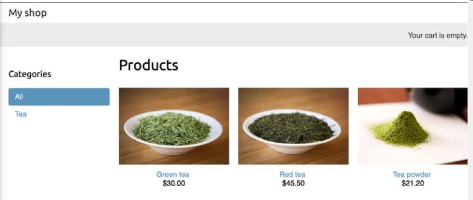
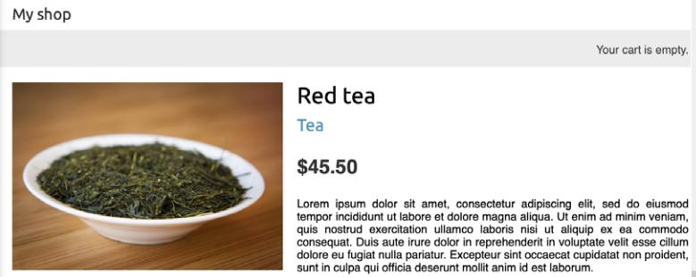

# E-Commmerce Lab

# Getting Started

## Set up libraries

1. Create or reuse a Django equipped virtual environment
2. Use pip to install Pillow version 8.3.2 or later for image handling

## Set up project

3. Start a new Django project called myshop
4. Start a new Django app called shop


# Create the models and views for your product catalogue
## Create models for myshop

1. Create Category model

   ```python
   from django.db import models
   from django.urls import reverse


   class Category(models.Model):
       name = models.CharField(max_length=200, db_index=True)
       slug = models.SlugField(max_length=200, unique=True)

       class Meta:
           ordering = ('name',)
           verbose_name = 'category'
           verbose_name_plural = 'categories'

       def __str__(self):
           #TODO

       def get_absolute_url(self):
           return reverse('shop:product_list_by_category',
                         args=[self.slug])

   ```

2. Create Product model with the following fields

   - category: A ForeignKey to the Category model. This is a one-to-many relationship: a product belongs to one category and a category contains multiple products.
   - name: The name of the product.
   - slug: The slug for this product to build beautiful URLs.
   - image: An optional product image.
   - description: An optional description of the product.
   - price: This field uses Python's decimal.Decimal type to store a fixedprecision decimal number. The maximum number of digits (including
     the decimal places) is set using the max_digits attribute and decimal
     places with the decimal_places attribute.
   - available: A Boolean value that indicates whether the product is available
     or not. It will be used to enable/disable the product in the catalog.
   - created: This field stores when the object was created.
   - updated: This field stores when the object was last updated.

    ```python
        class Product(#TODO):
            category = #TODO
            slug = models.SlugField(#TODO)
            image = models.ImageField(upload_to='products/%Y/%m/%d', blank=True)
            description = models.TextField(blank=True)
            updated = models.DateTimeField(auto_now=True)
            #TODO

            class Meta:
                ordering = ('name',)
                index_together = (('id', 'slug'),)

            def __str__(self):
                #TODO

            def get_absolute_url(self):
                return reverse('shop:product_detail',
                            args=[self.id, self.slug])
    ```

3. Make and apply migrations

## Set up the Admin

1. Create the CategoryAdmin class
   - List the name and slug fields
   - Prepopulate the slug from the name
   ```python
   class CategoryAdmin(admin.ModelAdmin):
       list_display = ['name', 'slug']
       prepopulated_fields = {'slug': ('name',)}
   ```
2. Create the ProductAdmin class
 - List everything except the image and description
 - Filter for the appropriate fields
 - Make the **price** and **available** editable (Hint: **list_editable**)
 - Prepopulate the slug
3. Register the classes
4. Don't forget to set up a superuser

## Build Views for the models in the shop application

1. Create the product_list view
   This view should display all available products or, if passed a category_slug, then it should display the products filtered by it
2. Create the product_detail view
   This view should display a single product by id. Additionally, it should accept and use a
   slug (this helps build SEO-friendly URLs) and return only available products

## Build the urls

Each path should have an internal name that matches the view name unless otherwise specified

1. The default path should resolve to product_list
2. The path category_slug should resolve to product_list. Call this product_list_by_category internally
3. The path id/slug should resolve to product_detail
4. Don't forget to reference the shop urls in the main url file

## Add the get_absolute_url methods to each model

Django has a convention that the method get_absolute_url() will return the URL for a given object

1. Modify the model classes using the following code

   ```python
   from django.urls import reverse
   # ...

   class Category(models.Model):
      # ...
   def get_absolute_url(self):
      return reverse('shop:product_list_by_category',
      args=[self.slug])

   class Product(models.Model):
      # ...
      def get_absolute_url(self):
      return reverse('shop:product_detail',
      args=[self.id, self.slug])
   ```


## Create templates for your views

Be sure your templates are in the product template directory for the shop application indicated below.

1. Create the base.html template in `shop\templates\shop\` as follows:
   ```html
   
    <!DOCTYPE html>
    <html>

    <head>
    <meta charset="utf-8" />
    <title>My shop</title>
    <link href="" rel="stylesheet">
    </head>

    <body>
    <div id="header">
        <a href="/" class="logo">My shop</a>
    </div>
    <div id="subheader">
        <div class="cart">
        Your cart is empty.
        </div>
    </div>
    <div id="content">
        
        
    </div>
    </body>

    </html>
   ```
2. Create the list.html product in the  `shop\templates\shop\product` as follows:
   ```html
   #TBD1
    
    <div id="sidebar">
    <h3>Categories</h3>
    <ul>
        <li class="selected" >
        <a href="">All</a>
        </li>
        #TBD2
    </ul>
    </div>
    <div id="main" class="product-list">
    <h1>{{ category.name }}Products
        </h1>
    
    <div class="item">
        <a href="{{ product.get_absolute_url }}">
        
        </a>
        <a href="{{ product.get_absolute_url }}">{{ product.name }}</ a>
        <br>
        ${{ product.price }}
    </div>
    
    </div>
    
   ```
3. Include the requisite Django instructions to include static files and define a block called title at #TBD1
4. Provide a default title using the category.name if one exists or "Products" if it does not
5. Complete the code for the categories at #TBD2. If the category.slug matches the slug for the current list item, then set the HTML attribute to select that item
6. Copy the resource files provided to the `static` directory of the shop application
7. Add the following code to settings.py
    ```python
    MEDIA_URL = '/media/'
    MEDIA_ROOT = os.path.join(BASE_DIR, 'media/')
    ```
8. Add the following code to the main urls.py file to support media:
   ```python
    from django.conf import settings
    from django.conf.urls.static import static
    urlpatterns = [
        # ...
    ]
    if settings.DEBUG:
        urlpatterns += static(settings.MEDIA_URL, document_root=settings.MEDIA_ROOT)
   ```
9. If you want to, go ahead and test the product view now (see below)
10. Add the detail_view.html template in the same folder as list.html as follows:
    ```html
    
    
    
    {{ product.name }}
    
    
    <div class="product-detail">Chapter 7
    
    <h1>{{ product.name }}</h1>
    <h2>
        <a href="{{ product.category.get_absolute_url }}">
        {{ product.category }}
        </a>
    </h2>
    <p class="price">${{ product.price }}</p>
    {{ product.description|linebreaks }}
    </div>
    
    ```
## Test the views
Run your server and add a couple of products using the admin site. Be sure to include some pictures. If you do not include a picture then the page will display a "no image available" image. 

### Your list page should look like


### Your detail page should look like

 
# Build a shopping cart
## How to use sessions
The shopping cart will utilize [Django sessions](https://docs.djangoproject.com/en/3.2/topics/http/sessions/), so be sure that the MIDDLEWARE setting of your project contains `django.contrib.sessions.middleware.SessionMiddleware`. Session is accessed like a dictionary as follows:
```python
request.session['foo'] = 'bar'      # write
foo = request.session['foo']        # read 
foo = request.session.get('foo')    # read (gets None if nonexistant) 
del request.session['foo']          # delete
```
By using sessions, we get rapid access to temporary data that will delete itself automatically either when the browser closes (`SESSION_EXPIRE_AT_BROWSER_CLOSE`) or at the end of the period set in `SESSION_COOKIE_AGE`. 
## Shopping cart design
- Create a cart when needed if none exists; otherwise use existing cart
- Store price in cart to insulate against price changes
## Implement the shopping cart
1. Create a shopping cart app called `cart`
2. Store the session id for the shopping cart in `settings.py` in a `CART_SESSION_ID` variable. Pick an appropriate id, i.e. `'cart'`.
3. Create a `cart.py` file in the cart application with a constructor as follows:
```python
from decimal import Decimal
from django.conf import settings
from shop.models import Product

class Cart(object):
    def __init__(self, request):
    """
    Initialize the cart.
    """
    self.session = request.session
    cart = self.session.get(settings.CART_SESSION_ID)
    if not cart:
        # save an empty cart in the session
        cart = self.session[settings.CART_SESSION_ID] = {}
     self.cart = cart
```
4. Create an add method with the the following signature
```python
    def add(self, product, quantity=1, override_quantity=False):
    """
    Add a product to the cart or update its quantity
        product: The product to add
            Use the string representation of the product.id to store it into session
        quantity: The quantity of product to add
        override_quantity: True to replace the existing quantity, false to add to it
    """
    #TBD
```
5. Create a save method as follows:
   ```python
   def save(self):
       # mark the session as "modified" to make sure it gets saved
       self.session.modified = True
   ```
6. Create a remove method
7. To enable iteration over the cart items in client code, you should create an [iterator](https://www.programiz.com/python-programming/iterator) for it as follows:
   ```python
   class Cart(object):
   # ...
   def __iter__(self):
       """
       Iterate over the items in the cart and get the products
       from the database.
       """
       product_ids = self.cart.keys()
       # get the product objects and add them to the cart
       products = Product.objects.filter(id__in=product_ids)
       cart = self.cart.copy()
       for product in products:
           cart[str(product.id)]['product'] = product
       for item in cart.values():
           item['price'] = Decimal(item['price'])
           item['total_price'] = item['price'] * item['quantity']
           yield item
   ```
8. Implement a `__len__` method for the cart that returns the total quantity of items in the cart (sum of quantity for all products)
9. Implement a `get_total_price` method that returns the total price for the cart (sum of price * quantity)
10. Implement a `clear` method which removes the entire shopping cart from the session
11. 